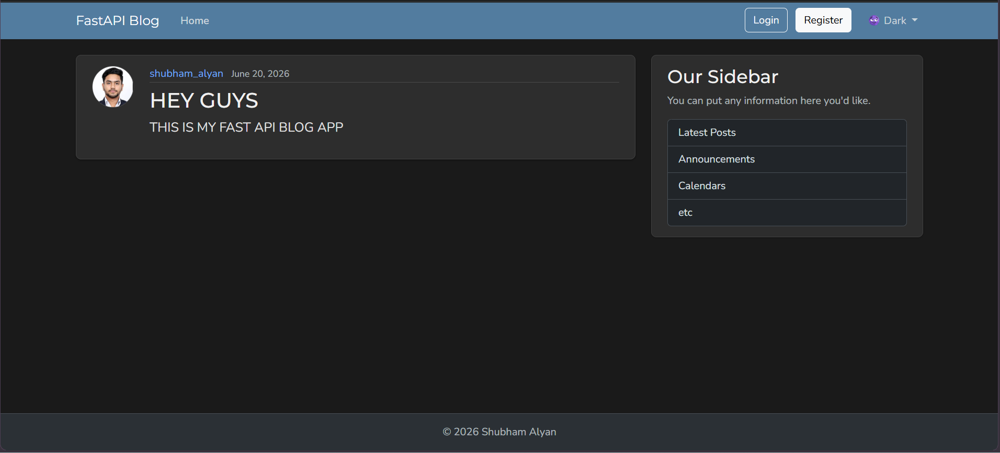
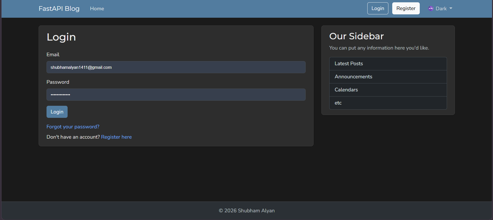
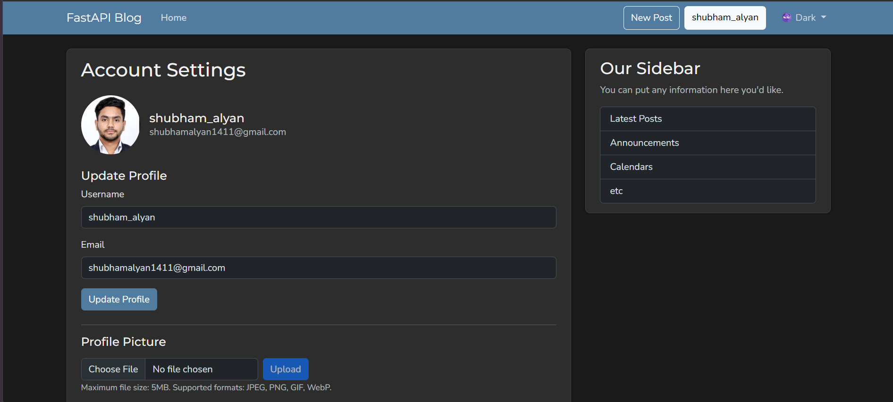
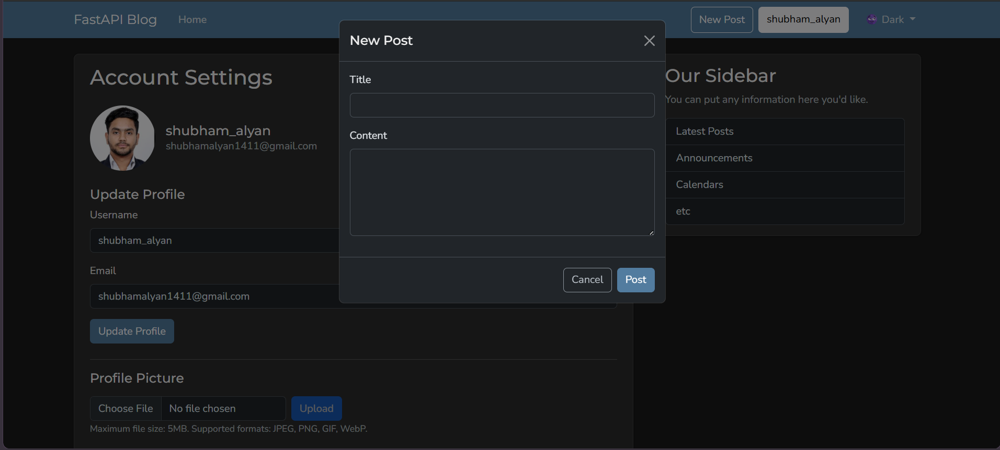

# FastAPI Blog Platform


A full-stack blog application built with FastAPI, featuring JWT authentication, async PostgreSQL access, AWS S3-backed file storage, password reset flows, automated testing, Docker containerization, and deployment on Render.

---

## Live Demo

https://fastapi-blog-platform.onrender.com

*(Hosted on Render's free tier — the first request after inactivity may take 30–60 seconds to wake the server.)*

---

## Features

* JWT Authentication & Authorization
* User Registration and Login
* Password Reset via Email
* Blog Post CRUD Operations
* Ownership-Based Permissions
* Profile Picture Uploads
* AWS S3 File Storage
* Async PostgreSQL Database Access
* Alembic Database Migrations
* Pagination Support
* Automated Testing with Pytest
* Dockerized Deployment
* Responsive Bootstrap UI
* Dark/Light Theme Support

---

## Tech Stack

| Layer            | Technology             |
| ---------------- | ---------------------- |
| Backend          | FastAPI                |
| Database         | PostgreSQL             |
| ORM              | SQLAlchemy 2.0 (Async) |
| Migrations       | Alembic                |
| Templates        | Jinja2                 |
| Frontend         | Bootstrap 5            |
| Authentication   | JWT + Argon2           |
| Storage          | AWS S3                 |
| Email            | aiosmtplib             |
| Image Processing | Pillow                 |
| Testing          | Pytest                 |
| Deployment       | Docker + Render        |

---

## Architecture

```text
Browser
   |
FastAPI
   |
   |---- PostgreSQL
   |
   |---- AWS S3
   |
   `---- Email Service
```

---

## Screenshots

| Home                               | Login                                |
| ---------------------------------- | ------------------------------------ |
|  |  |

| Profile                                  | Create Post                                      |
| ---------------------------------------- | ------------------------------------------------ |
|  |  |

---

## Quick Start

### Clone Repository

```bash
git clone https://github.com/shubham-alyan24/FastAPI-Blog-Platform.git
cd FastAPI-Blog-Platform
```

### Create Virtual Environment

```bash
python -m venv .venv
```

Windows:

```bash
.venv\Scripts\Activate.ps1
```

Linux/macOS:

```bash
source .venv/bin/activate
```

### Install Dependencies

```bash
pip install -r requirements.txt
```

### Run Database Migrations

```bash
alembic upgrade head
```

### Start Development Server

```bash
fastapi dev main.py
```

Application:

```text
http://localhost:8000
```

Swagger Docs:

```text
http://localhost:8000/docs
```

---

## Environment Variables

Create a `.env` file:

```env
DATABASE_URL=
SECRET_KEY=
ALGORITHM=HS256
ACCESS_TOKEN_EXPIRE_MINUTES=30
RESET_TOKEN_EXPIRE_MINUTES=60

MAIL_SERVER=
MAIL_PORT=
MAIL_USERNAME=
MAIL_PASSWORD=
MAIL_FROM=

S3_BUCKET_NAME=
S3_REGION=
S3_ACCESS_KEY_ID=
S3_SECRET_ACCESS_KEY=
```

---

## Running Tests

```bash
pytest tests/ -v
```

---

## Docker

Build image:

```bash
docker build -t fastapi-blog .
```

Run container:

```bash
docker run -p 8000:8000 --env-file .env fastapi-blog
```

---

## Project Structure

```text
main.py
models.py
schemas.py
database.py
auth.py
config.py
email_utils.py
image_utils.py

routers/
├── users.py
└── posts.py

templates/
static/
tests/
alembic/

Dockerfile
requirements.txt
```

---

## Security Highlights

* JWT-based authentication
* Argon2 password hashing
* Ownership checks for post modification
* Password reset tokens stored as hashes
* Protection against user enumeration
* File validation using Pillow
* UUID-based file naming
* Secure environment variable configuration

---

## Future Improvements

* Rate Limiting
* Full-Text Search
* Comment System
* User Roles & Permissions
* CI/CD Pipeline
* Expanded Test Coverage

---

## Acknowledgements

This project was built independently by me while learning FastAPI.

The following resources were used for learning, reference, and troubleshooting during development:

- FastAPI Official Documentation — https://fastapi.tiangolo.com/
- Corey Schafer's FastAPI Tutorial Series — https://www.youtube.com/@coreyms
- CodeWithHarry FastAPI Tutorials — https://www.youtube.com/@CodeWithHarry
- DevSheets FastAPI Reference Sheets — https://devsheets.io/sheets/fastapi

While these resources were used for learning and guidance, the application's implementation, architecture, deployment, testing setup, AWS integration, Docker configuration, and project structure were developed and customized independently.

---

## Author

**Shubham Alyan**

GitHub: https://github.com/shubham-alyan24

Project Repository: https://github.com/shubham-alyan24/FastAPI-Blog-Platform

Live Demo: https://fastapi-blog-platform.onrender.com
